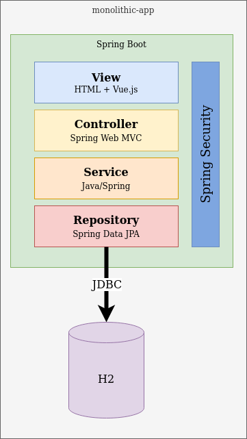
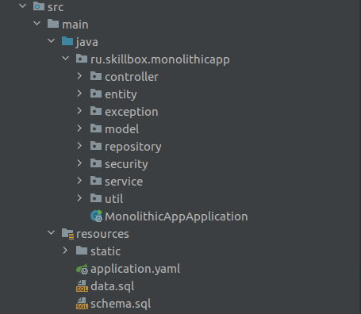

# 12 Стульев (monolithic-app)
__monolithic-app__ - монолитное приложение, разработанное для компании 12 Стульев.

## Навигация

- [Бизнес требования](#Бизнес-требования)
- [Архитектура приложения](#Архитектура-приложения)
    - [Пояснительная записка](#Пояснительная-записка)
- [Навигация по проекту](#Навигация-по-проекту)
- [Обзор технологий](#Обзор-технологий)
- [Точки доступа](#Точки-доступа)
- [Как запустить](#Как-запустить)

## Бизнес требования

Приложение выполняет следующие бизнес-функции:
- панель администратора:
    - управление пользователями системы, не являющихся покупателями (создание / удаление / изменение паролей);
- регистрация клиента (покупателя);
- аутентификация клиента (покупателя);
- склад:
    - пополнение;
    - изменение информации о товаре;
- заказы:
    - принятие;
    - оплата;
    - нотификация об изменении статуса;
- доставка:
    - назначение курьера;
    - доставка заказа клиенту.

## Архитектура приложения

### Пояснительная записка
Приложение написано с использованием Spring-Boot фреймворка и состоит из следующих слоев:
- View - слой отвечающий за отображение web-страниц в браузере. Слой состоит из статических HTML файлов и клиентской 
логики написанной с использованием реактивного фреймворка Vue.js. В качестве web-сервера выступает само приложение,
которое раздает статику с помощью Spring MVC
- Controller - слой отвечает за принятие REST запросов из браузера клиента и передаче управления слою Service.
- Service - слой обработки бизнес-логики.
- Repository - слой доступа к базе данных.
- Security - отдельная сущность, которая может быть применена к любому слою, ответственность - обеспечение безопасности.

В качестве базы данных используется встроенная в приложения RDBMS H2. 

## Навигация по проекту

- controller - пакет, в котором находятся классы, отвечающие за обработку REST запросов
- entity - пакет с сущностями, которые проецируют реляционную структуру таблиц в нашей базе данных на объектно-ориентированные Java-классы
- exception - пакет с бизнес-исключениями, которые могут быть выброшены из нашего прикладного кода
- model - пакет с классами для отображения данных на фронте
- repository - пакет с DAO слоем
- security - пакет с конфигурацией Spring Security. Тут определяются правила доступа к нашему приложению для различных ролей
- service - пакет с классами, имплементирующими бизнес-логику
- util - пакет с утилитарными классами
- resources
    - static - директория со статическими HTML файлами
    - application.yaml - конфигурация приложения
    - data.sql - наполнение базы данных (DML)
    - schema.sql - Инициализация базы данных (DDL)

## Обзор технологий
- Frontend:
    - HTML
    - Bootstrap
    - Vue.js
    - axios
- Backend:
    - Java 8
    - Spring Boot:
        - Spring MVC
        - Spring Data JPA
        - Spring Security
- Database:
    - H2
- DevOps
    - Maven

## Точки доступа

### Адреса и порты
| Функция                        | Адрес          |                  
|:-------------------------------|:---------------|
|   Точка доступа к приложению   | localhost:8080 | 

### Учетные записи
| Логин       | Пароль   | Роль      |                  
|:------------|:---------|:----------|
|  admin      | admin    |  ADMIN    |
|  customer   | customer |  CUSTOMER |
|  deliver    | deliver  |  DELIVER  |    
|  supplier   | supplier |  SUPPLIER |

## Как запустить
Для сборки и запуска приложения вам понадобиться:
- JDK 8 [Скачать тут](https://www.oracle.com/ru/java/technologies/javase/javase-jdk8-downloads.html)
- Maven [Скачать тут](https://maven.apache.org/download.cgi)

Команды ниже нужно выполнять в корневой директории с проектом.

Для сборки:
`mvn clean install`

Для запуска:
`java -jar target/monolithic-app-1.0.0.jar`

Для пользователей Windows может быть полезен git-bash, который является частью утилиты git [Скачать тут](https://git-scm.com/downloads)